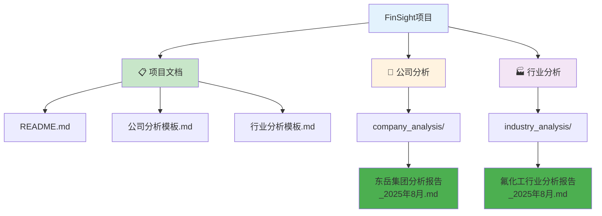
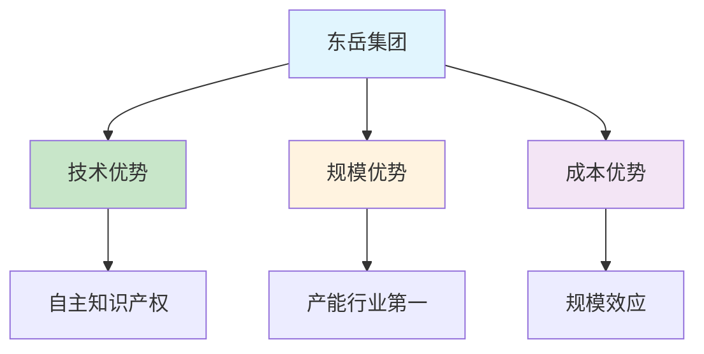

# FinSight - 公司分析与行业研究平台 🚀

<div align="center">


**专业的公司分析与行业研究平台**

*基于主流分析框架，提供标准化分析模板和深度研究报告*

</div>

---

## ✨ 项目特色

- **📊 标准化分析框架**: 基于主流公司分析理论，提供系统化的分析模板
- **🎨 可视化图表展示**: 丰富的Mermaid图表，让数据更加直观易懂
- **🔍 深度行业研究**: 结合定量和定性分析，提供全面的行业洞察
- **📈 实时数据更新**: 基于最新市场数据和政策趋势进行分析
- **🛠️ 专业分析工具**: 包含财务分析、竞争分析、风险评估等专业工具
- **🎯 美观易读排版**: 优化的Markdown格式，提升阅读体验

---

## 📁 文件结构

```
FinSight/
├── README.md                           # 项目说明文档
├── 公司分析模板.md                     # 通用公司分析模板
├── 行业分析模板.md                     # 通用行业分析模板
├── company_analysis/                   # 公司分析报告文件夹
│   └── 东岳集团分析报告_2025年8月.md   # 东岳集团深度分析报告 ✨
└── industry_analysis/                  # 行业分析报告文件夹
    └── 氟化工行业分析报告_2025年8月.md # 氟化工行业深度分析报告 ✨
```

### 🗂️ 项目结构可视化



---

## 🎨 分析模板特色

### 1. 公司分析模板 📊
适用于各类公司的全面分析，包含：
- 🏢 **公司概况分析**: 基本信息、股权结构、管理层
- 🏭 **行业环境分析**: 行业概况、产业链、竞争格局
- 💰 **商业模式分析**: 盈利模式、核心竞争力、护城河
- 📈 **财务分析**: 盈利能力、成长性、运营效率、财务健康度
- 🎯 **战略分析**: 发展战略、投资布局、风险因素
- 💎 **投资价值评估**: 优势分析、劣势分析、投资建议

### 2. 行业分析模板 🏭
适用于制造业、化工、新材料等行业，包含：
- 🏭 **行业基础信息**: 定义分类、规模地位、行业特征
- 🔗 **产业链分析**: 产业链结构、价值链、供应链
- 📊 **市场结构分析**: 市场集中度、竞争格局、进入壁垒
- 📈 **需求供给分析**: 需求结构、驱动因素、供给约束
- 🔬 **技术发展分析**: 技术现状、发展趋势、技术影响
- ⚖️ **政策环境分析**: 产业政策、环保政策、贸易政策
- 🌍 **国际比较分析**: 国际地位、国际分工、国际经验
- 🚀 **发展趋势分析**: 短期、中期、长期趋势预测
- 💰 **投资机会与风险**: 投资机会、风险评估、投资建议

---

## 🎯 可视化图表特色

### Mermaid图表类型
- **📊 流程图**: 展示业务流程和逻辑关系
- **🥧 饼图**: 显示市场份额和结构分布
- **📈 甘特图**: 展示时间规划和趋势预测
- **🎯 雷达图**: 多维度能力评估
- **🔗 关系图**: 展示产业链和竞争关系

### 图表示例


---

## 📖 使用方法

### 1. 选择合适模板 🎯
- **分析单个公司**: 使用"公司分析模板"
- **分析整个行业**: 使用"行业分析模板"

### 2. 收集相关信息 📚
- 公司公告和财报
- 行业研究报告
- 政策法规文件
- 市场数据统计

### 3. 按模板框架分析 🔍
- 逐项填写相关信息
- 进行定量和定性分析
- 形成分析结论
- 给出投资建议

### 4. 定期更新维护 📅
- 跟踪最新数据
- 更新分析结论
- 记录重要变化

---

## 📊 分析案例展示

### 东岳集团分析案例 🏢
- **公司背景**: 氟化工行业龙头企业
- **分析重点**: 技术优势、规模效应、新能源材料发展
- **投资建议**: 🟢 **买入评级**，目标价格8.5港元
- **风险提示**: 环保政策风险、原材料价格波动风险

**特色图表**:
- 股权结构饼图
- 产业链流程图
- 财务趋势图
- 护城河评估表
- 风险因素图

### 氟化工行业分析案例 🏭
- **行业特征**: 技术密集型、强周期、政策敏感
- **发展趋势**: 绿色化、高端化、智能化
- **投资机会**: 新型制冷剂、含氟新材料、电子化学品
- **主要风险**: 环保政策变化、技术更新换代

**特色图表**:
- 全球市场分布饼图
- 竞争格局分析图
- 技术发展趋势图
- 投资机会分析图
- 风险评估矩阵

---

## 🎨 报告美化特色

### 视觉元素
- **🎨 彩色图标**: 使用emoji和彩色标识增强视觉效果
- **📊 数据表格**: 清晰的数据展示和对比
- **🔍 图表可视化**: Mermaid图表让复杂关系一目了然
- **📱 响应式设计**: 适配不同设备的阅读体验

### 排版优化
- **📋 报告概览**: 快速了解关键信息
- **🎯 重点突出**: 使用颜色和图标突出重要内容
- **📝 结构化内容**: 清晰的层级结构和导航
- **💡 信息卡片**: 关键信息以卡片形式展示

---

## 📅 更新记录

- **2025年8月**: 项目创建，完成基础模板和东岳集团分析报告
- **2025年8月**: ✨ **重大更新** - 优化报告美观度，添加丰富图表和可视化元素
- **2025年8月**: 🗂️ **项目重组** - 创建company_analysis和industry_analysis文件夹，优化项目结构
- **数据来源**: 公司公告、行业报告、公开数据
- **分析团队**: FinSight专业分析团队

---

## ⚠️ 注意事项

1. **📊 数据准确性**: 所有分析基于公开信息，请核实数据准确性
2. **💰 投资风险**: 分析报告不构成投资建议，投资有风险，入市需谨慎
3. **📅 定期更新**: 建议定期更新分析报告，跟踪最新变化
4. **🎯 个性化调整**: 可根据具体公司和行业特点调整分析框架
5. **📱 图表兼容**: Mermaid图表需要支持的环境才能正常显示

---

## 🔧 技术特性

- **📝 Markdown格式**: 标准Markdown语法，兼容性强
- **🎨 Mermaid图表**: 丰富的图表类型，支持流程图、饼图、甘特图等
- **📊 数据可视化**: 表格、矩阵、评估表等多种数据展示形式
- **🎯 响应式设计**: 适配桌面和移动设备
- **🔍 结构化内容**: 清晰的导航和层级结构

---

## 📞 联系方式

如有问题或建议，请联系FinSight分析团队。

---

<div align="center">

**🚀 FinSight - 专业的公司分析与行业研究平台**

*让投资分析更加专业、直观、美观*

</div>
