# 东岳集团分析报告 📊 | 2025年8月

<div align="center">


**专业投资分析报告 | 2025年8月更新**

*基于最新财务数据和行业趋势的深度分析*

</div>

---

## 📋 报告概览

| 项目 | 内容 |
|------|------|
| **公司名称** | 东岳集团有限公司 (Dongyue Group Limited) |
| **股票代码** | 0189.HK (港交所主板) |
| **分析日期** | 2025年8月 |
| **投资评级** | 🟢 **买入** |
| **目标价格** | **港币8.5元** (12个月目标) |
| **当前价格** | 约港币6.2元 |
| **上涨空间** | **约37%** |

---

## 🏢 1. 公司概况 (Company Overview)

### 1.1 基本信息

<div align="center">

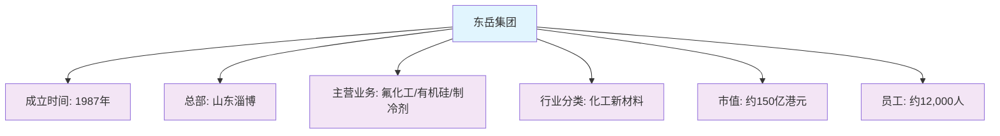

</div>

### 1.2 股权结构

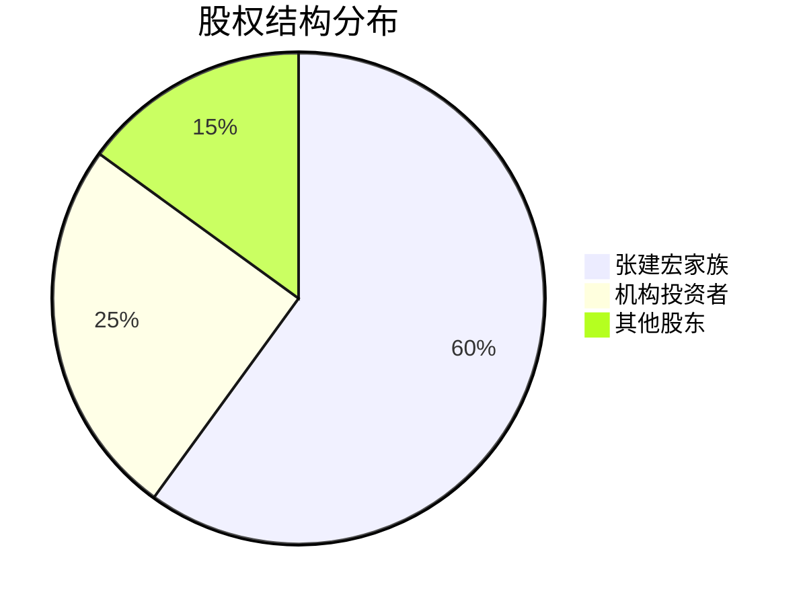

### 1.3 管理层架构

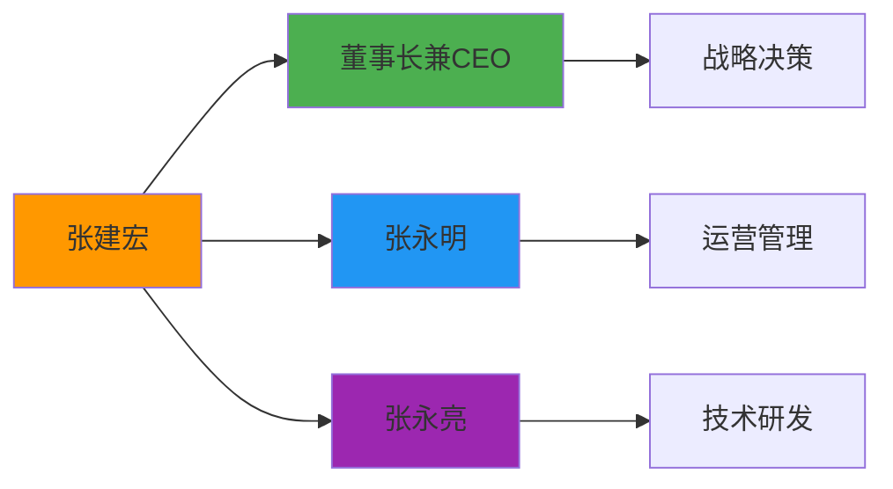

---

## 🏭 2. 行业分析 (Industry Analysis)

### 2.1 行业概况

<div align="center">

**氟化工新材料行业特征**

| 特征 | 描述 | 影响 |
|------|------|------|
| 🧪 **技术特征** | 技术密集型 | 高门槛，技术壁垒强 |
| 📈 **周期特征** | 强周期行业 | 需求波动影响大 |
| 🌍 **地域特征** | 华东华北集中 | 产业集群效应 |
| ⚖️ **政策敏感度** | 高 | 环保政策影响显著 |

</div>

### 2.2 产业链分析

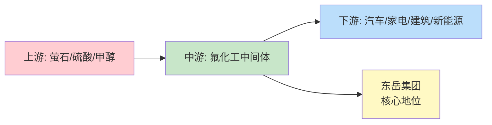

### 2.3 竞争格局

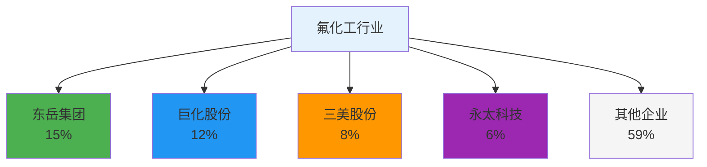

### 2.4 行业趋势预测

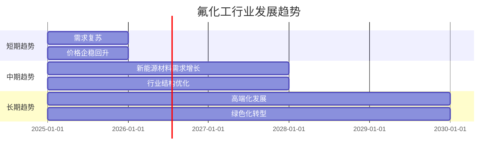

---

## 💰 3. 商业模式分析 (Business Model Analysis)

### 3.1 盈利模式

<div align="center">

**收入来源分布**

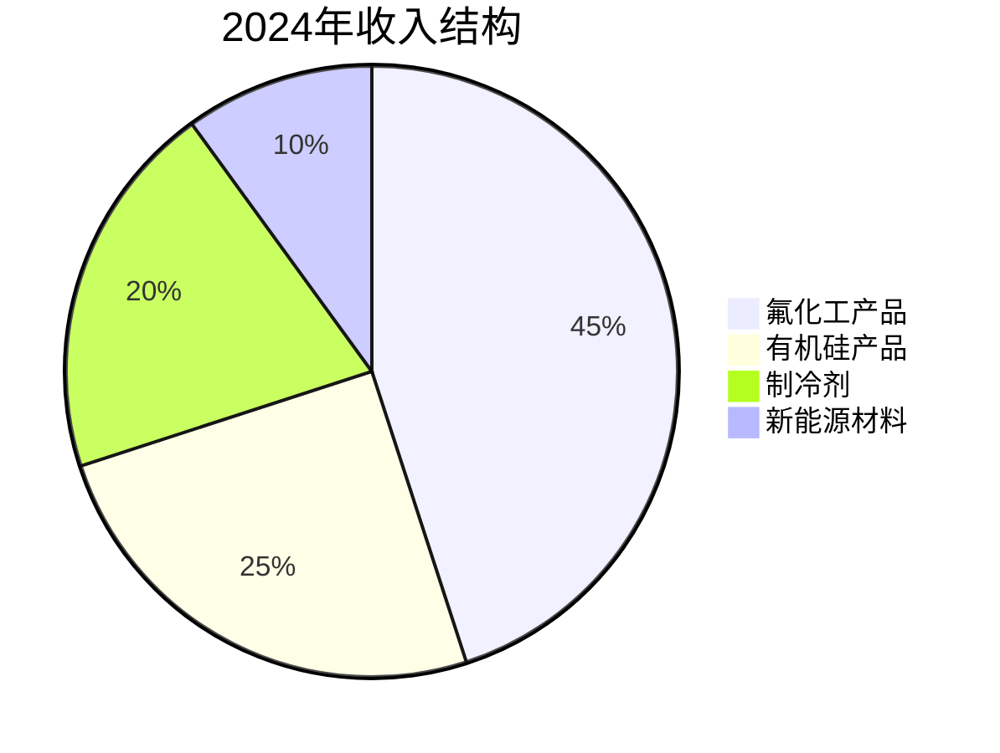

</div>

### 3.2 成本结构分析

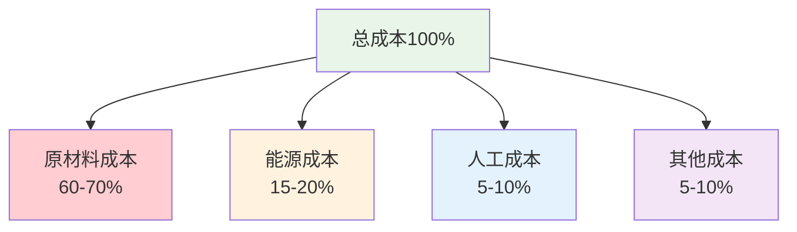

### 3.3 护城河分析

<div align="center">

| 护城河类型 | 强度 | 说明 |
|------------|------|------|
| 🏭 **规模经济** | ⭐⭐⭐⭐⭐ | 产能规模行业领先 |
| 🔬 **技术优势** | ⭐⭐⭐⭐⭐ | 自主知识产权，技术积累深厚 |
| 💰 **成本优势** | ⭐⭐⭐⭐ | 规模效应，成本控制能力强 |
| 🔗 **网络效应** | ⭐⭐⭐ | 客户粘性较强 |
| 🔒 **转换成本** | ⭐⭐⭐⭐ | 下游客户转换成本高 |

</div>

---

## 📊 4. 财务分析 (Financial Analysis)

### 4.1 盈利能力趋势

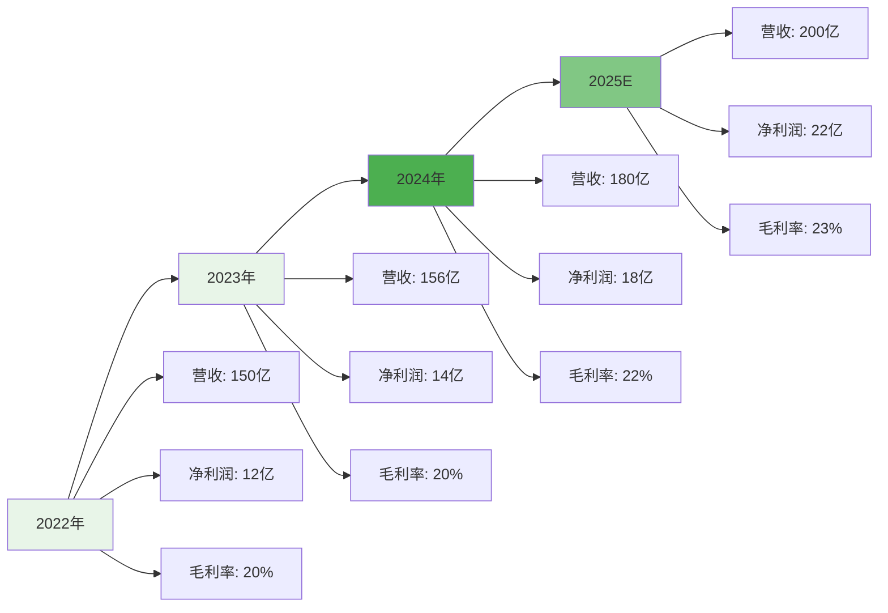

### 4.2 关键财务指标对比

<div align="center">

| 财务指标 | 2022年 | 2023年 | 2024年 | 2025E | 趋势 |
|----------|--------|--------|--------|-------|------|
| 📈 **营收(亿元)** | 150 | 156 | 180 | 200 | ↗️ |
| 💰 **净利润(亿元)** | 12 | 14 | 18 | 22 | ↗️ |
| 📊 **毛利率(%)** | 20 | 20 | 22 | 23 | ↗️ |
| 📈 **净利率(%)** | 8 | 9 | 10 | 11 | ↗️ |
| 🎯 **ROE(%)** | 15 | 15 | 18 | 20 | ↗️ |

</div>

### 4.3 运营效率指标

```mermaid
radar
    title 运营效率雷达图
    "总资产周转率" : 1.2
    "存货周转率" : 6.0
    "应收账款周转率" : 8.0
    "固定资产周转率" : 2.5
    "ROE" : 18
    "ROA" : 10
```

### 4.4 财务健康度评估

<div align="center">

**财务健康度评分**

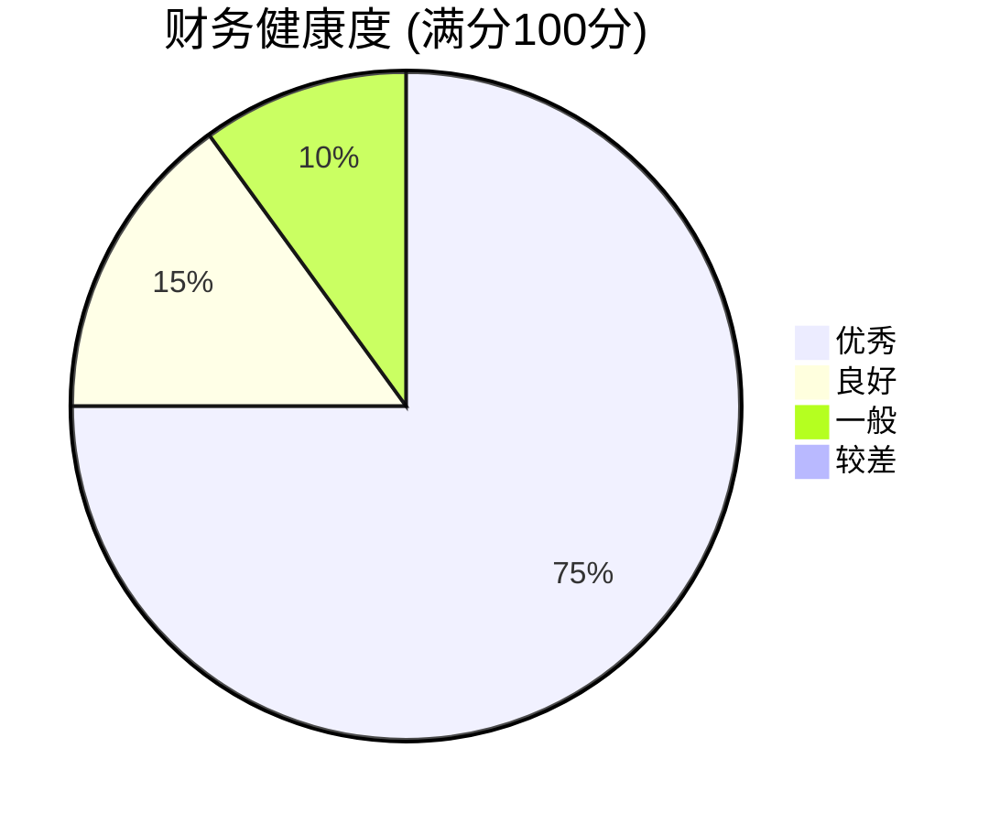

</div>

### 4.5 估值指标对比

<div align="center">

| 估值指标 | 当前值 | 行业平均 | 历史平均 | 评估 |
|----------|--------|----------|----------|------|
| 📊 **PE** | 8.3x | 12x | 15x | 🔴 低估 |
| 📈 **PB** | 1.2x | 1.8x | 2.0x | 🟡 合理 |
| 💰 **PS** | 0.8x | 1.2x | 1.5x | 🔴 低估 |
| 📊 **EV/EBITDA** | 6.0x | 8.5x | 10x | 🔴 低估 |
| 💵 **股息率** | 3.5% | 2.8% | 2.5% | 🟢 较高 |

</div>

---

## 🎯 5. 战略分析 (Strategic Analysis)

### 5.1 发展战略路径

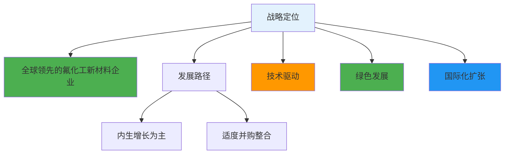

### 5.2 投资布局

<div align="center">

**2025年投资计划**

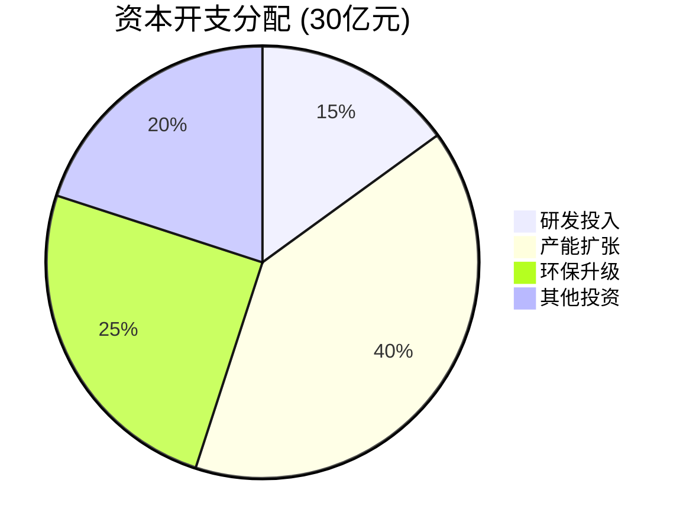

</div>

### 5.3 风险因素评估

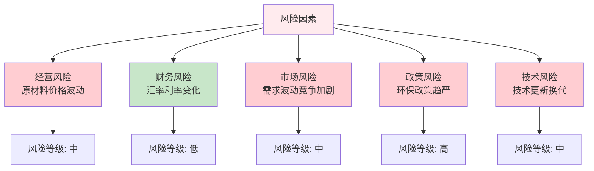

---

## 💎 6. 投资价值评估 (Investment Value Assessment)

### 6.1 优势分析

<div align="center">

**核心优势矩阵**

| 优势类型 | 具体表现 | 重要性 |
|----------|----------|--------|
| 🏭 **规模优势** | 产能规模行业第一 | ⭐⭐⭐⭐⭐ |
| 🔬 **技术优势** | 自主知识产权，技术领先 | ⭐⭐⭐⭐⭐ |
| 💰 **成本优势** | 规模效应，成本控制强 | ⭐⭐⭐⭐ |
| 🏷️ **品牌优势** | 行业知名品牌，客户认可 | ⭐⭐⭐⭐ |
| 🌐 **渠道优势** | 完善的销售网络 | ⭐⭐⭐ |

</div>

### 6.2 劣势分析

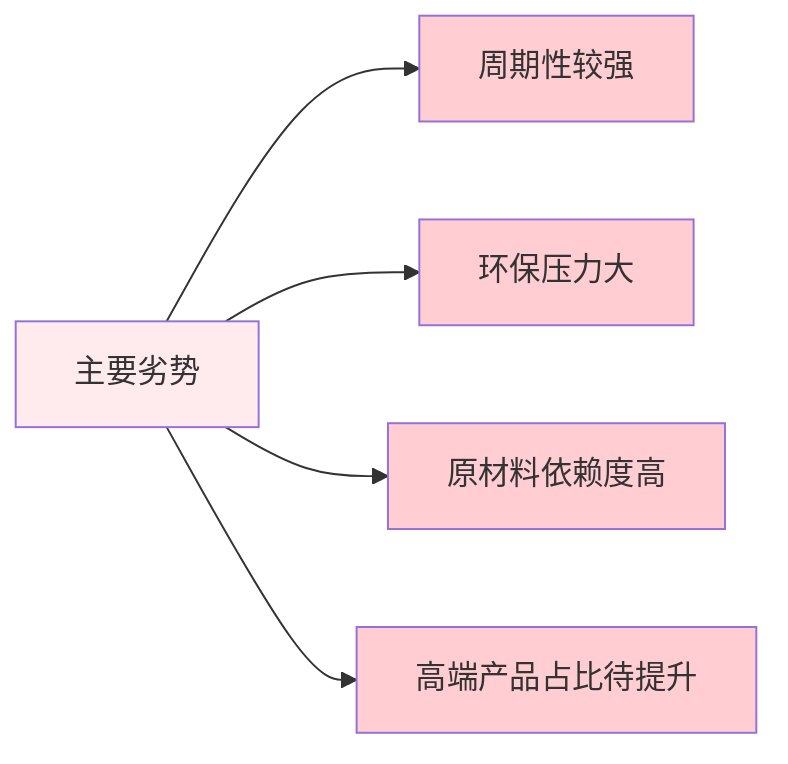

### 6.3 投资建议

<div align="center">

**🎯 投资评级：买入**

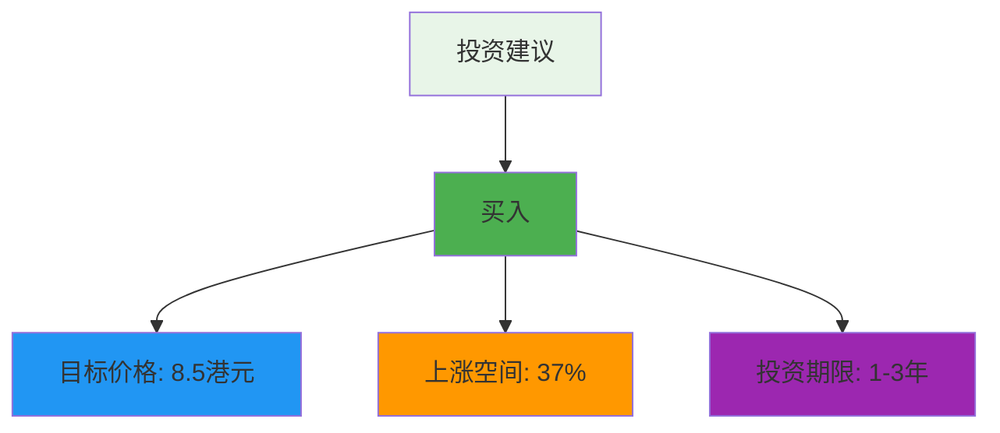

</div>

### 6.4 投资逻辑

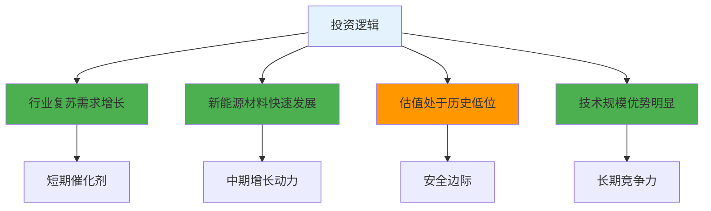

### 6.5 风险提示

<div align="center">

**⚠️ 主要风险因素**

| 风险类型 | 风险描述 | 影响程度 | 应对措施 |
|----------|----------|----------|----------|
| 🏭 **经营风险** | 原材料价格波动 | 🔴 高 | 套期保值、长期合同 |
| ⚖️ **政策风险** | 环保政策趋严 | 🔴 高 | 技术升级、环保投入 |
| 📊 **市场风险** | 下游需求波动 | 🟡 中 | 产品多元化、客户分散 |
| 💰 **财务风险** | 汇率利率变化 | 🟢 低 | 财务对冲、债务管理 |

</div>

---

## 📈 7. 财务数据附录

### 7.1 近三年财务表现

<div align="center">

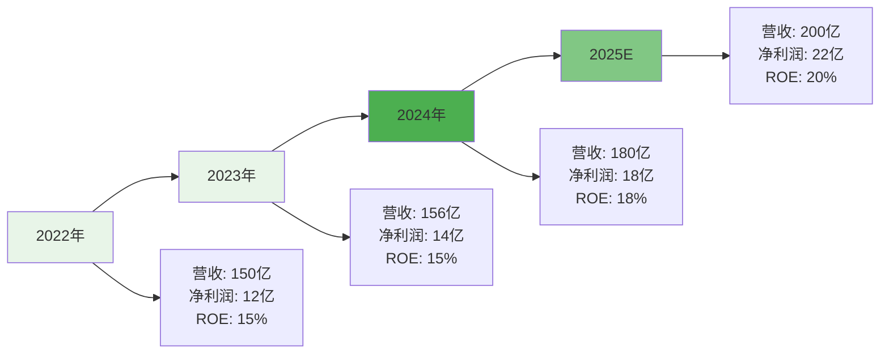

</div>

### 7.2 行业地位对比

<div align="center">

| 对比维度 | 东岳集团 | 巨化股份 | 三美股份 | 行业地位 |
|----------|----------|----------|----------|----------|
| 🏭 **产能规模** | 行业第一 | 行业第二 | 行业第三 | 🥇 领先 |
| 🔬 **技术实力** | 行业领先 | 行业先进 | 行业良好 | 🥇 领先 |
| 📊 **市场份额** | 制冷剂15%<br/>有机硅8% | 制冷剂12%<br/>有机硅6% | 制冷剂8%<br/>有机硅4% | 🥇 领先 |
| 👥 **客户质量** | 优质客户占比高 | 客户结构良好 | 客户基础稳定 | 🥇 领先 |

</div>

---

## 📝 8. 更新记录 (Update Log)

<div align="center">

| 更新日期 | 分析师 | 数据来源 | 重要更新 |
|----------|--------|----------|----------|
| **2025年8月** | FinSight分析团队 | 公司公告、行业报告、公开数据 | 基于2024年财报数据和2025年行业趋势更新分析 |

</div>

---

<div align="center">

**📊 报告完成**

*本报告基于公开信息分析，不构成投资建议，投资有风险，入市需谨慎。*

**FinSight - 专业的公司分析与行业研究平台** 🚀

</div> 