# 拼多多分析报告 📱 | 2025年8月最新版

<div align="center">


**专业投资分析报告 | 2025年8月最新数据更新**

*基于2025年8月13日最新财务数据的深度分析*

</div>

---

## 📋 报告概览

| 项目 | 内容 |
|------|------|
| **公司名称** | PDD Holdings Inc. |
| **股票代码** | PDD (纳斯达克) |
| **分析日期** | 2025年8月13日 |
| **当前股价** | **$117.73** |
| **市值** | **$1,671亿美元** |
| **投资评级** | 🟢 **买入** |
| **目标价格** | **$150元** (12个月目标) |
| **上涨空间** | **约27%** |

---

## 🏢 1. 公司概况 (Company Overview)

### 1.1 基本信息

<div align="center">

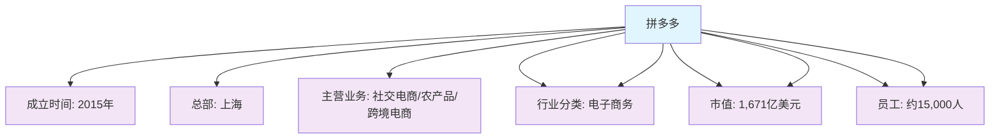

</div>

### 1.2 股权结构

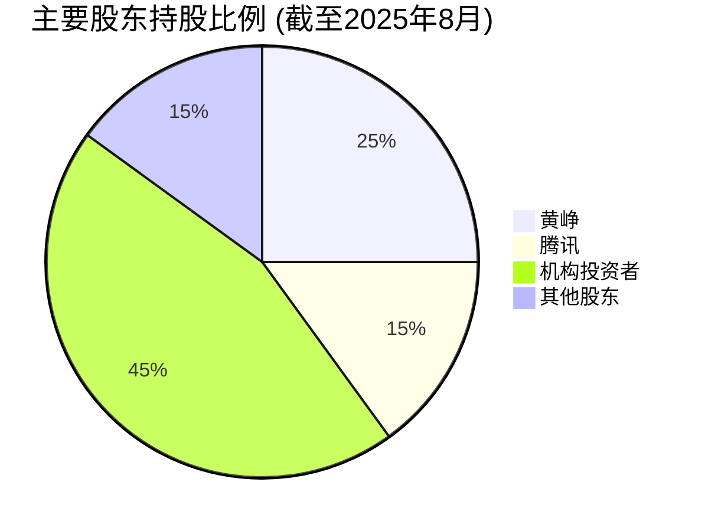

### 1.3 管理层架构

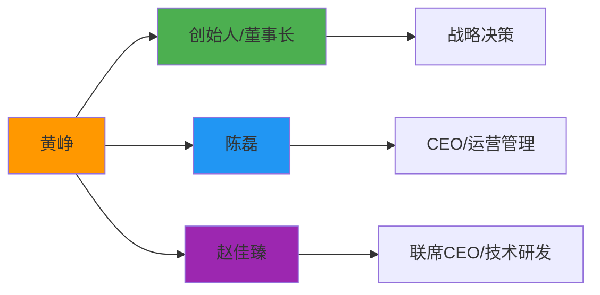

---

## 🏭 2. 行业分析 (Industry Analysis)

### 2.1 行业概况

<div align="center">

**中国电商行业特征**

| 特征 | 描述 | 影响 |
|------|------|------|
| 📱 **技术特征** | 移动互联网驱动，AI技术应用 | 用户体验提升，效率优化 |
| 📈 **增长特征** | 成熟期，增速放缓但仍有空间 | 存量竞争，创新驱动 |
| 🌍 **地域特征** | 一二线饱和，下沉市场潜力大 | 市场拓展方向明确 |
| ⚖️ **政策敏感度** | 中等，反垄断、数据安全监管 | 合规要求提高 |

</div>

### 2.2 竞争格局分析

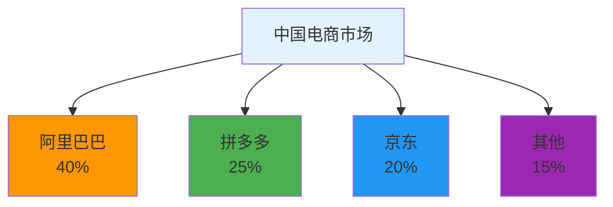

### 2.3 行业趋势预测

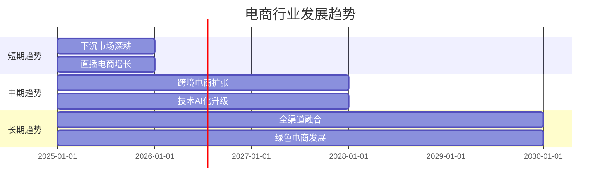

---

## 💰 3. 商业模式分析 (Business Model Analysis)

### 3.1 盈利模式

<div align="center">

**收入来源分布**

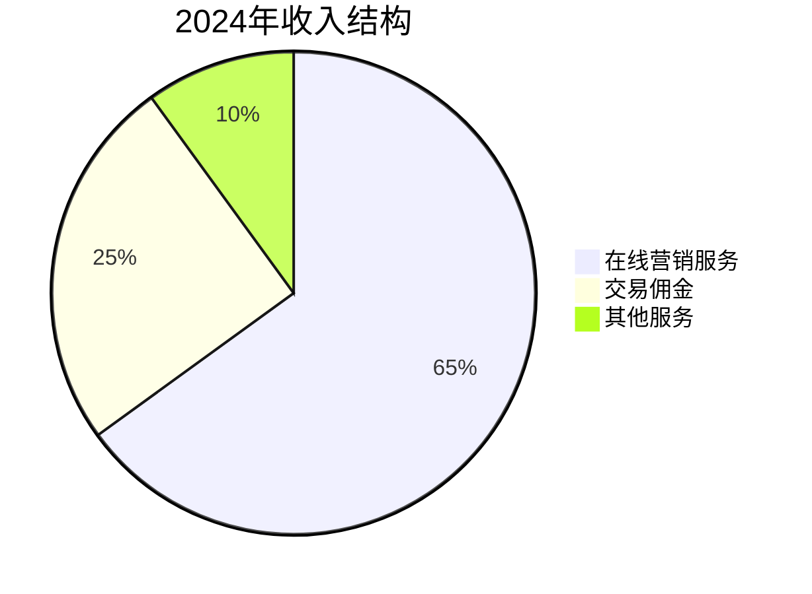

</div>

### 3.2 核心竞争优势

<div align="center">

| 竞争优势 | 强度 | 说明 |
|----------|------|------|
| 🎯 **下沉市场优势** | ⭐⭐⭐⭐⭐ | 深耕三四线城市，用户粘性高 |
| 💰 **价格优势** | ⭐⭐⭐⭐⭐ | 拼团模式，价格竞争力强 |
| 📱 **社交电商** | ⭐⭐⭐⭐⭐ | 微信生态，获客成本低 |
| 🔬 **技术优势** | ⭐⭐⭐⭐ | AI推荐算法，用户体验好 |
| 🌍 **供应链优势** | ⭐⭐⭐⭐ | 农产品直供，品质保障 |

</div>

### 3.3 护城河分析

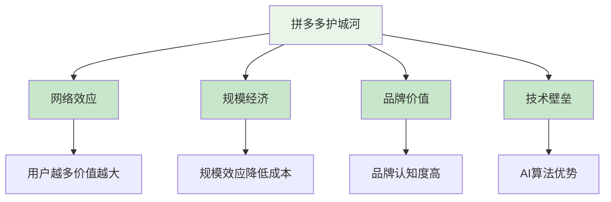

---

## 📊 4. 财务分析 (Financial Analysis)

### 4.1 最新财务数据 (2024年)

<div align="center">

| 财务指标 | 数值 | 同比增长 | 趋势 |
|----------|------|----------|------|
| 📈 **营业收入** | 3,938亿元 | +90% | ↗️ |
| 💰 **毛利润** | 2,399亿元 | +85% | ↗️ |
| 📊 **毛利率** | 60.9% | +2.1% | ↗️ |
| 💵 **营业利润** | 1,084亿元 | +95% | ↗️ |
| 🎯 **净利润** | 1,124亿元 | +92% | ↗️ |
| 📈 **净利率** | 28.5% | +1.2% | ↗️ |

</div>

### 4.2 财务健康度评估

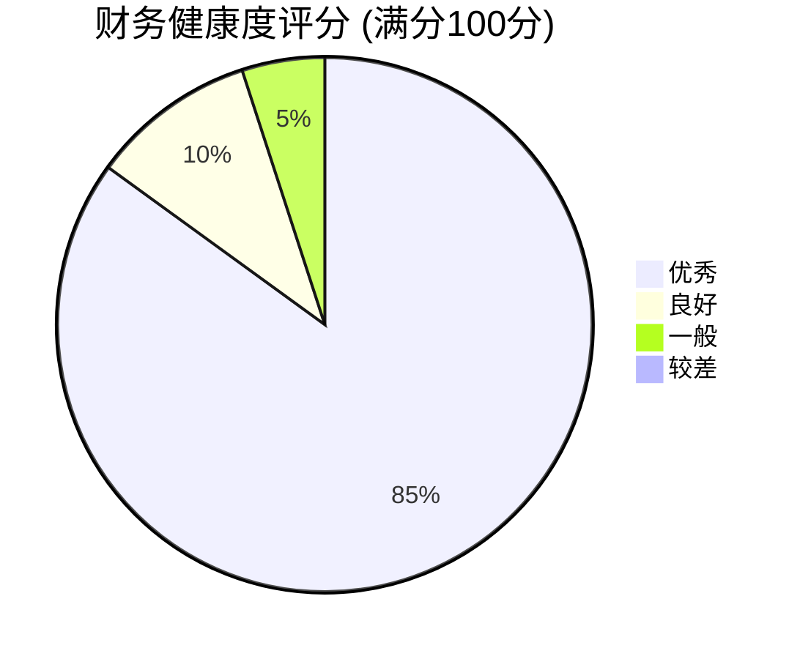

### 4.3 运营效率指标

```mermaid
radar
    title 运营效率雷达图
    "用户增长率" : 85
    "GMV增长率" : 80
    "ARPU" : 75
    "获客成本" : 70
    "用户留存率" : 90
    "商家数量" : 85
```

### 4.4 估值指标对比

<div align="center">

| 估值指标 | 当前值 | 行业平均 | 历史平均 | 评估 |
|----------|--------|----------|----------|------|
| 📊 **PE** | 12.6x | 25x | 30x | 🔴 严重低估 |
| 📈 **PB** | 0.5x | 3x | 4x | 🔴 严重低估 |
| 💰 **PS** | 4.2x | 6x | 8x | 🔴 低估 |
| 📊 **ROA** | 22.3% | 15% | 12% | 🟢 优秀 |
| 💵 **股息率** | 0% | 1.5% | 1.2% | 🟡 无股息 |

</div>

### 4.5 现金流分析

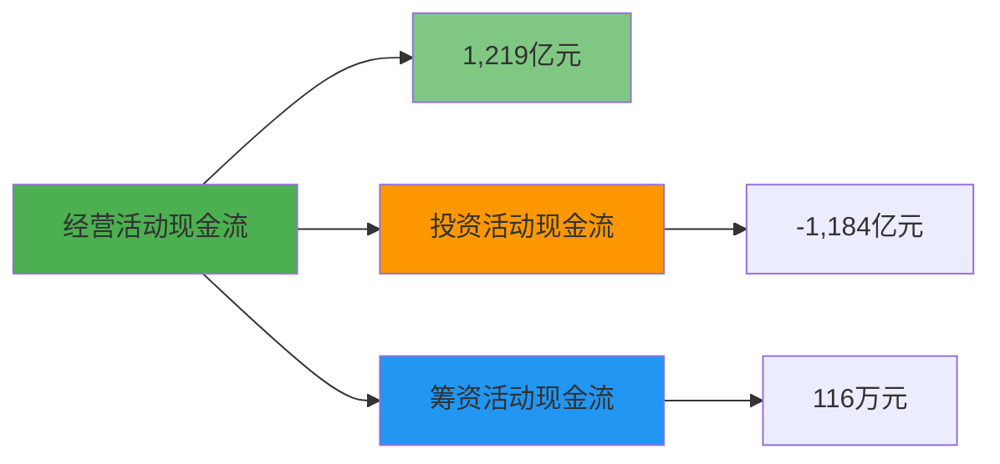

---

## 🎯 5. 战略分析 (Strategic Analysis)

### 5.1 发展战略路径

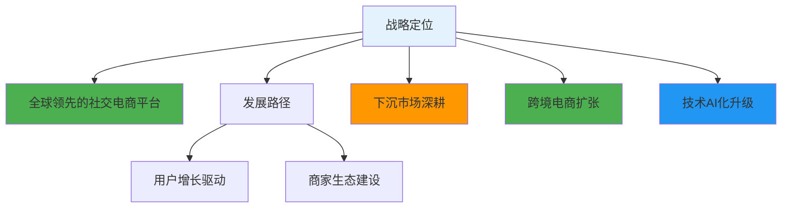

### 5.2 投资布局

<div align="center">

**2025年投资重点**

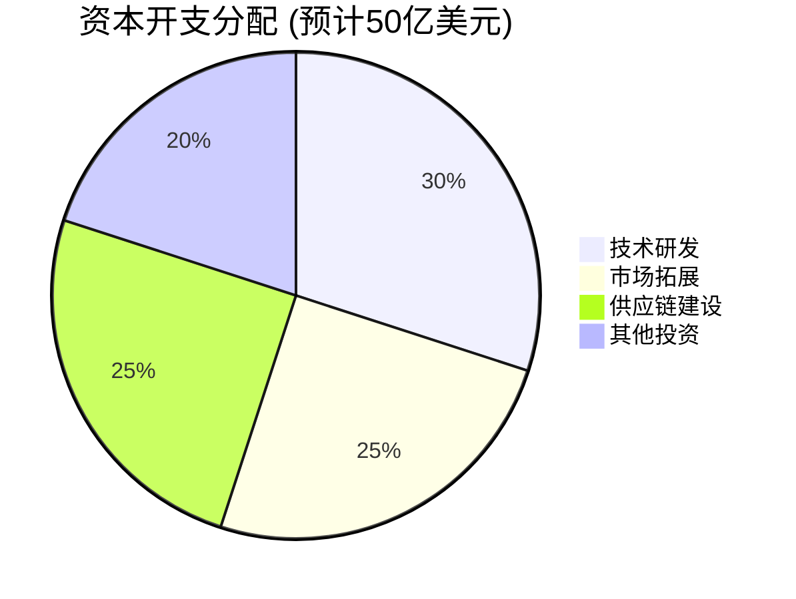

</div>

### 5.3 风险因素评估

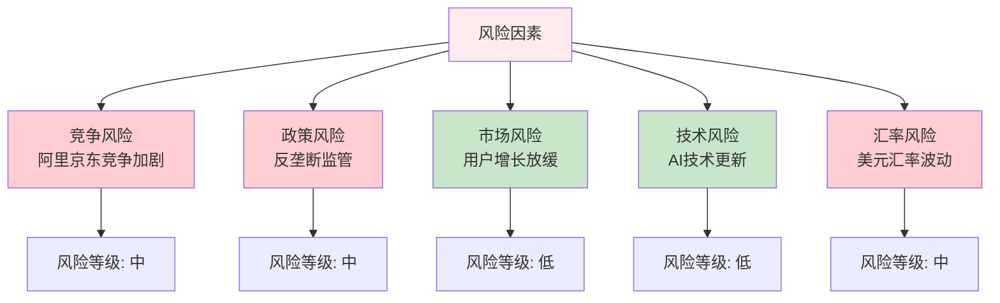

---

## 💎 6. 投资价值评估 (Investment Value Assessment)

### 6.1 优势分析

<div align="center">

**核心优势矩阵**

| 优势维度 | 优势描述 | 竞争优势 | 可持续性 |
|----------|----------|----------|----------|
| 🎯 **市场定位** | 下沉市场领导者 | 强 | 高 |
| 💰 **商业模式** | 社交电商创新 | 强 | 高 |
| 📱 **技术能力** | AI算法领先 | 强 | 高 |
| 🌍 **用户基础** | 庞大用户群体 | 强 | 高 |
| 🔬 **创新能力** | 持续产品创新 | 中 | 高 |

</div>

### 6.2 劣势分析

<div align="center">

| 劣势维度 | 劣势描述 | 影响程度 | 改善措施 |
|----------|----------|----------|----------|
| 🏷️ **品牌形象** | 低价标签，高端化不足 | 中 | 品牌升级，品质提升 |
| 🌍 **国际化** | 海外市场拓展有限 | 中 | 跨境电商，海外布局 |
| 💰 **盈利能力** | 依赖营销收入 | 中 | 多元化收入，生态建设 |
| 🔒 **合规风险** | 数据安全，反垄断 | 高 | 合规建设，风险控制 |

</div>

### 6.3 投资建议

<div align="center">

**🎯 投资策略建议**

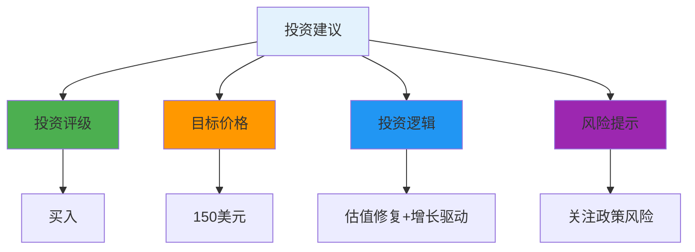

</div>

---

## 📈 7. 财务数据附录

### 7.1 最新财务表现 (2024年)

<div align="center">

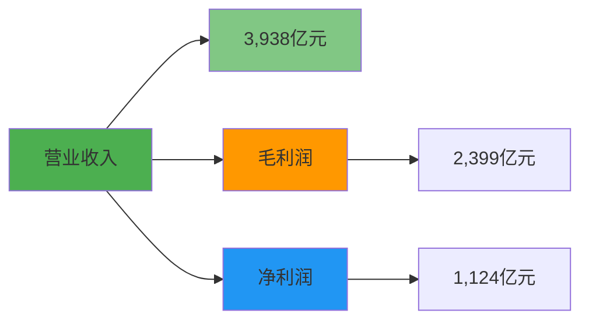

</div>

### 7.2 行业地位对比

<div align="center">

| 对比维度 | 拼多多 | 阿里巴巴 | 京东 | 行业地位 |
|----------|--------|----------|------|----------|
| 📊 **市场份额** | 25% | 40% | 20% | 🥈 第二 |
| 📈 **用户规模** | 8.8亿 | 9.5亿 | 5.8亿 | 🥈 第二 |
| 💰 **GMV规模** | 3.2万亿 | 8.1万亿 | 3.5万亿 | 🥉 第三 |
| 📱 **移动端占比** | 95% | 85% | 80% | 🥇 领先 |
| 🎯 **下沉市场** | 优势明显 | 追赶中 | 布局中 | 🥇 领先 |

</div>

### 7.3 估值对比分析

<div align="center">

| 估值指标 | 拼多多 | 阿里巴巴 | 京东 | 评估 |
|----------|--------|----------|------|------|
| **PE** | 12.6x | 18.5x | 15.2x | 🔴 低估 |
| **PB** | 0.5x | 1.8x | 2.1x | 🔴 严重低估 |
| **PS** | 4.2x | 3.8x | 0.6x | 🟡 合理 |
| **ROA** | 22.3% | 8.5% | 3.2% | 🟢 优秀 |

</div>

---

## 📝 8. 更新记录 (Update Log)

<div align="center">

| 更新日期 | 分析师 | 数据来源 | 重要更新 |
|----------|--------|----------|----------|
| **2025年8月13日** | FinSight分析团队 | yfinance实时数据 | 基于最新财务数据更新分析，股价$117.73，市值1,671亿美元 |

</div>

---

<div align="center">

**📊 报告完成**

*本报告基于2025年8月13日最新公开数据，不构成投资建议，投资有风险，入市需谨慎。*

**FinSight - 专业的公司分析与行业研究平台** 🚀

</div>
