# 氟化工行业分析报告 🏭 | 2025年8月

<div align="center">


**深度行业研究报告 | 2025年8月更新**

*基于最新行业数据和政策趋势的全面分析*

</div>

---

## 📋 报告概览

| 项目 | 内容 |
|------|------|
| **行业名称** | 氟化工行业 |
| **行业代码** | C2614 (基础化学原料制造) |
| **分析日期** | 2025年8月 |
| **行业地位** | 🟢 **战略性新兴产业** |
| **发展阶段** | **成熟期向成长期过渡** |
| **市场规模** | **全球200亿美元，中国800亿元** |
| **增长预期** | **年增长率8-15%** |

---

## 🏭 1. 行业基础信息 (Industry Basic Information)

### 1.1 行业定义与分类

<div align="center">

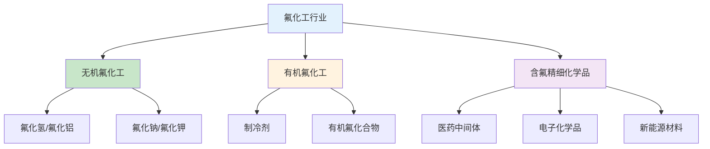

</div>

### 1.2 行业规模与地位

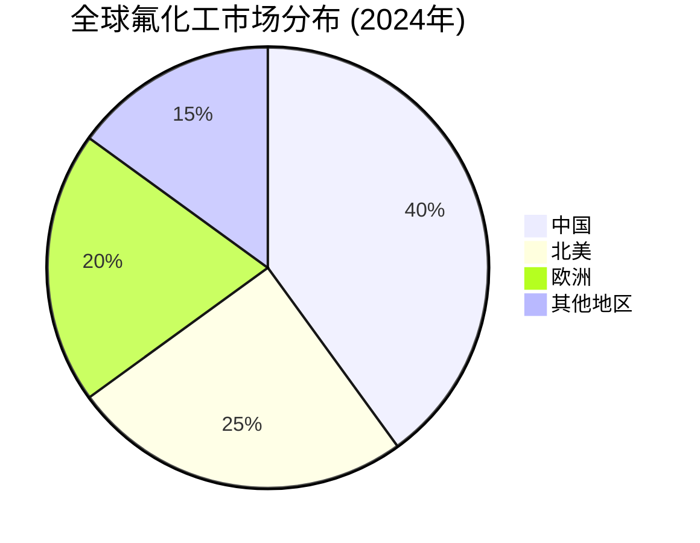

### 1.3 行业特征矩阵

<div align="center">

| 特征维度 | 特征描述 | 影响程度 | 应对策略 |
|----------|----------|----------|----------|
| 🧪 **技术特征** | 技术密集型，门槛高 | 🔴 高 | 加大研发投入，技术引进 |
| 📈 **周期特征** | 强周期，需求波动大 | 🔴 高 | 产品多元化，客户分散 |
| 🌍 **地域特征** | 华东华北集中分布 | 🟡 中 | 产业转移，区域平衡 |
| ⚖️ **政策敏感度** | 环保政策影响显著 | 🔴 高 | 技术升级，环保投入 |

</div>

---

## 🔗 2. 产业链分析 (Industry Chain Analysis)

### 2.1 产业链结构

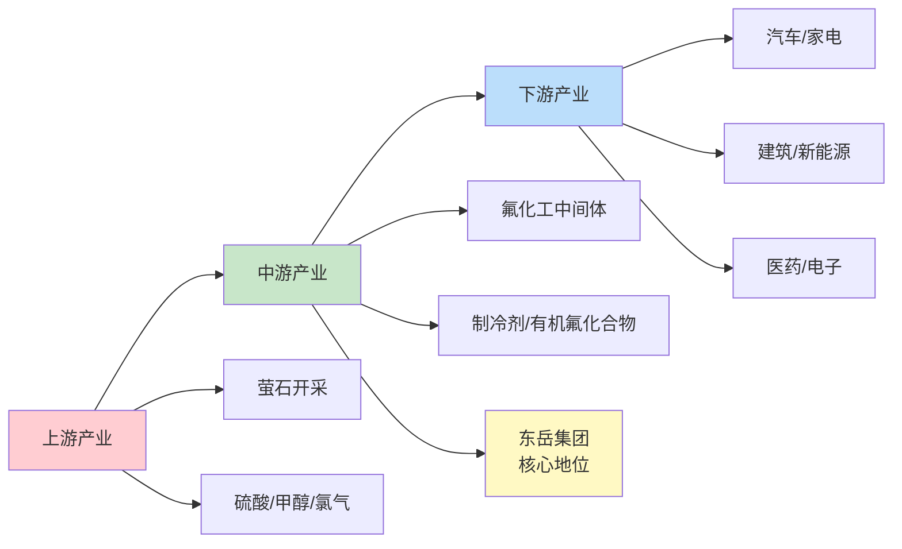

### 2.2 价值链分析

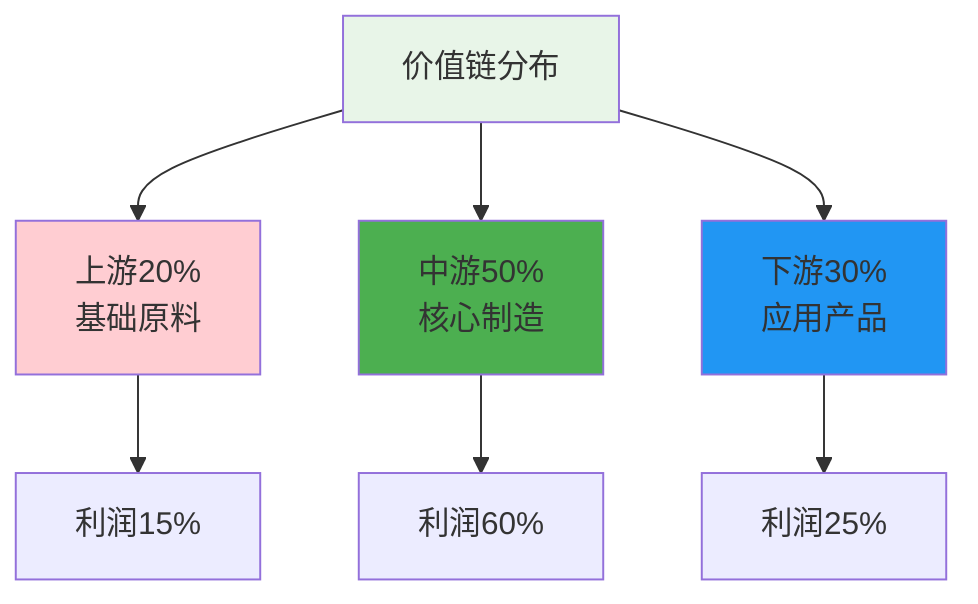

### 2.3 供应链分析

<div align="center">

**供应链关键节点分析**

| 环节 | 现状 | 风险等级 | 优化建议 |
|------|------|----------|----------|
| 🔍 **原材料供应** | 萤石资源有限，对外依存度高 | 🔴 高 | 资源储备，多元化采购 |
| 🏭 **中间品供应** | 产业链完整，自给率较高 | 🟢 低 | 保持优势，技术升级 |
| 🚚 **物流配送** | 以公路运输为主，铁路为辅 | 🟡 中 | 多式联运，成本优化 |
| 📦 **库存管理** | 季节性波动，管理要求高 | 🟡 中 | 智能预测，动态调整 |

</div>

---

## 📊 3. 市场结构分析 (Market Structure Analysis)

### 3.1 市场集中度分析

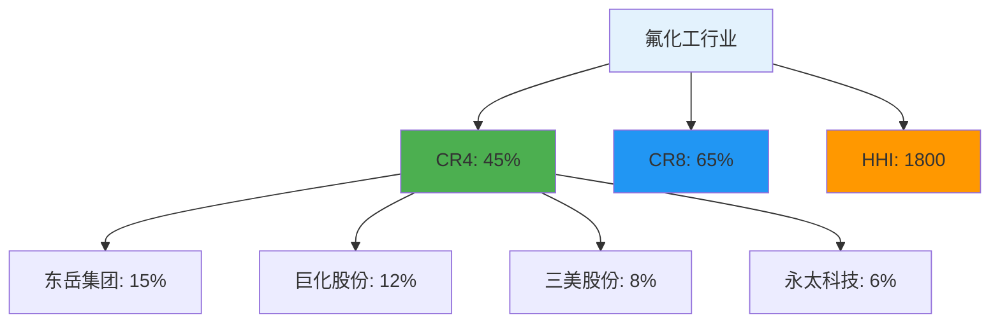

### 3.2 竞争格局分析

<div align="center">

**主要企业竞争分析**

| 企业 | 市场份额 | 技术实力 | 成本优势 | 竞争策略 |
|------|----------|----------|----------|----------|
| 🥇 **东岳集团** | 15% | ⭐⭐⭐⭐⭐ | ⭐⭐⭐⭐⭐ | 技术领先，规模效应 |
| 🥈 **巨化股份** | 12% | ⭐⭐⭐⭐ | ⭐⭐⭐⭐ | 成本控制，市场拓展 |
| 🥉 **三美股份** | 8% | ⭐⭐⭐ | ⭐⭐⭐⭐ | 差异化竞争，细分市场 |
| 🏅 **永太科技** | 6% | ⭐⭐⭐⭐ | ⭐⭐⭐ | 技术创新，高端产品 |

</div>

### 3.3 进入壁垒评估

```mermaid
radar
    title 进入壁垒雷达图 (满分100分)
    "技术壁垒" : 85
    "资金壁垒" : 80
    "政策壁垒" : 90
    "品牌壁垒" : 60
    "规模壁垒" : 75
    "渠道壁垒" : 65
```

---

## 📈 4. 需求分析 (Demand Analysis)

### 4.1 需求结构分析

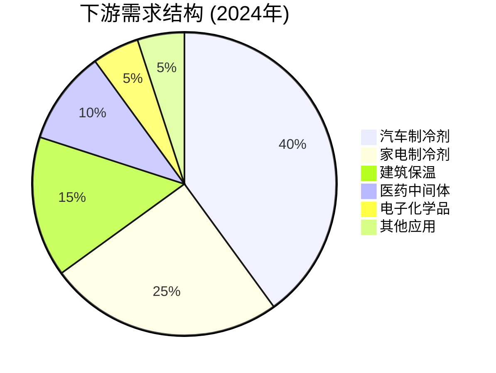

### 4.2 需求驱动因素

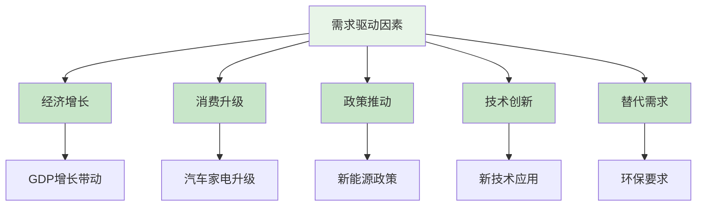

### 4.3 需求预测

<div align="center">

**需求增长预测**

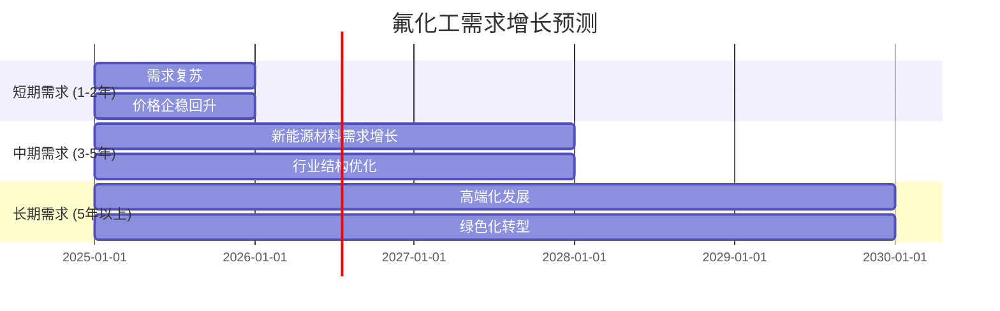

</div>

---

## 🏗️ 5. 供给分析 (Supply Analysis)

### 5.1 供给结构分析

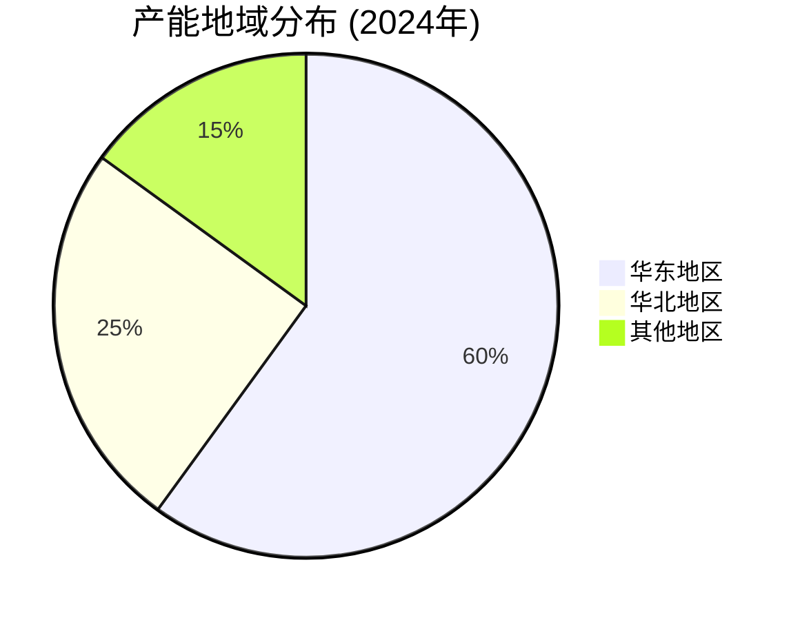

### 5.2 供给约束分析

<div align="center">

**供给约束因素评估**

| 约束类型 | 约束程度 | 具体表现 | 解决方案 |
|----------|----------|----------|----------|
| 🔍 **资源约束** | 🔴 高 | 萤石资源有限，对外依存度高 | 资源储备，多元化采购 |
| 🔬 **技术约束** | 🟡 中 | 高端技术突破难度大 | 加大研发，技术引进 |
| 🌱 **环保约束** | 🔴 高 | 环保要求不断提高 | 技术升级，环保投入 |
| ⚖️ **政策约束** | 🟡 中 | 产业政策限制低端产能 | 结构调整，高端化发展 |

</div>

### 5.3 供给预测

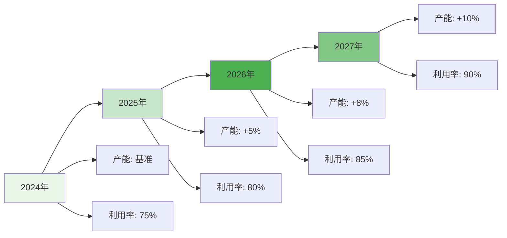

---

## 🔬 6. 技术发展分析 (Technology Development Analysis)

### 6.1 技术现状评估

<div align="center">

**技术水平对比**

| 技术领域 | 中国水平 | 国际先进水平 | 差距评估 | 追赶时间 |
|----------|----------|--------------|----------|----------|
| 🧪 **基础氟化工** | 先进 | 先进 | 基本同步 | - |
| ❄️ **制冷剂技术** | 先进 | 先进 | 基本同步 | - |
| 🔬 **有机氟化合物** | 良好 | 先进 | 3-5年 | 2028-2030 |
| 🆕 **含氟新材料** | 良好 | 先进 | 5-8年 | 2030-2033 |
| 🌱 **环保技术** | 良好 | 先进 | 3-5年 | 2028-2030 |

</div>

### 6.2 技术发展趋势

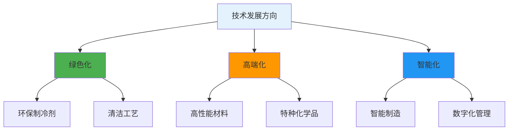

### 6.3 技术影响评估

```mermaid
radar
    title 技术影响评估 (满分100分)
    "产品性能提升" : 85
    "工艺优化" : 80
    "成本降低" : 70
    "竞争壁垒提高" : 90
    "应用领域扩大" : 85
    "环保水平提升" : 95
```

---

## ⚖️ 7. 政策环境分析 (Policy Environment Analysis)

### 7.1 产业政策分析

<div align="center">

**主要产业政策**

| 政策类型 | 政策名称 | 主要内容 | 影响评估 |
|----------|----------|----------|----------|
| 🏭 **支持政策** | 新材料产业发展规划 | 支持高端新材料发展 | 🟢 利好 |
| 🚫 **限制政策** | 限制低端产能扩张 | 淘汰落后工艺 | 🟡 中性 |
| 🎯 **规划目标** | 2025年高端产品占比60% | 产业结构优化 | 🟢 利好 |
| 🌱 **政策导向** | 高质量发展、绿色发展 | 技术升级、环保要求 | 🟢 利好 |

</div>

### 7.2 环保政策趋势

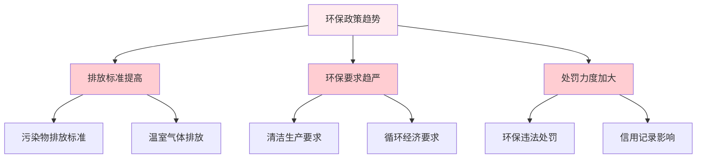

### 7.3 贸易政策分析

<div align="center">

**贸易政策影响**

| 政策领域 | 政策内容 | 影响程度 | 应对策略 |
|----------|----------|----------|----------|
| 📤 **出口政策** | 鼓励高端产品出口 | 🟢 利好 | 提升产品品质，拓展海外市场 |
| 💰 **关税政策** | 部分产品享受出口退税 | 🟢 利好 | 优化产品结构，提高出口竞争力 |
| 🚧 **贸易壁垒** | 技术性贸易壁垒增加 | 🟡 中性 | 技术升级，符合国际标准 |
| 🤝 **国际合作** | 加强国际技术合作 | 🟢 利好 | 技术引进，合作研发 |

</div>

---

## 🌍 8. 国际比较分析 (International Comparison Analysis)

### 8.1 国际地位评估

<div align="center">

**全球竞争力分析**

| 竞争力维度 | 中国排名 | 优势分析 | 差距分析 | 提升路径 |
|------------|----------|----------|----------|----------|
| 🏭 **产能规模** | 🥇 第一 | 产能最大，成本优势明显 | - | 保持优势，优化结构 |
| 🔬 **技术水平** | 🥈 第二 | 中低端技术成熟 | 高端技术有待提升 | 加大研发，技术引进 |
| 🏷️ **品牌价值** | 🥉 第三 | 成本优势，性价比高 | 品牌认知度不高 | 品牌建设，品质提升 |
| 🌐 **国际化程度** | 🥉 第三 | 出口规模大 | 海外投资少 | 海外布局，本土化 |

</div>

### 8.2 国际分工分析

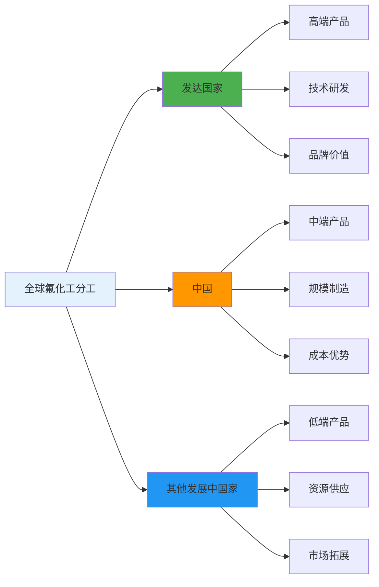

### 8.3 国际经验借鉴

<div align="center">

**国际发展经验总结**

| 国家/地区 | 发展模式 | 成功要素 | 借鉴意义 |
|-----------|----------|----------|----------|
| 🇺🇸 **美国** | 技术领先模式 | 研发投入大，产学研结合 | 加大研发投入，建立创新体系 |
| 🇯🇵 **日本** | 精益制造模式 | 工艺精细，品质管理 | 提升工艺水平，加强品质管理 |
| 🇩🇪 **德国** | 工匠精神模式 | 技术积累，工匠精神 | 技术传承，精益求精 |
| 🇰🇷 **韩国** | 追赶超越模式 | 技术引进，自主创新 | 技术引进消化，自主创新突破 |

</div>

---

## 🚀 9. 发展趋势分析 (Development Trend Analysis)

### 9.1 短期趋势 (1-2年)

<div align="center">

**短期市场趋势**

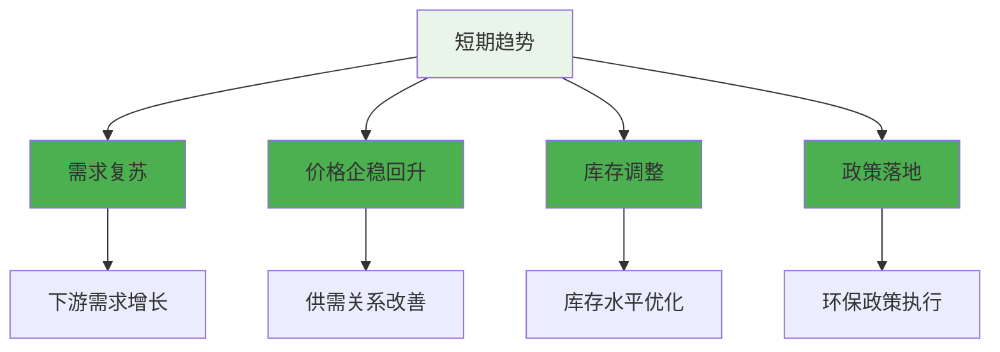

</div>

### 9.2 中期趋势 (3-5年)

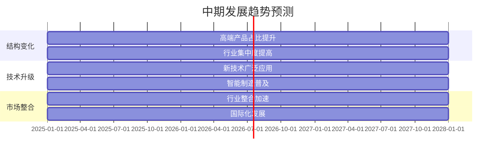

### 9.3 长期趋势 (5年以上)

<div align="center">

**长期发展方向**

| 发展方向 | 具体内容 | 实现路径 | 预期时间 |
|----------|----------|----------|----------|
| 🆕 **新材料拓展** | 向新材料、新能源领域拓展 | 技术研发，产品创新 | 2025-2035 |
| 🌱 **绿色化转型** | 绿色化、智能化、高端化 | 技术升级，工艺优化 | 2025-2035 |
| 🏭 **产业格局** | 形成寡头垄断格局 | 行业整合，优胜劣汰 | 2025-2035 |
| 🌍 **产业地位** | 成为战略性新兴产业支柱 | 政策支持，技术突破 | 2025-2035 |

</div>

---

## 💰 10. 投资机会与风险分析 (Investment Opportunity and Risk Analysis)

### 10.1 投资机会分析

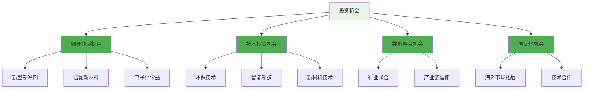

### 10.2 投资风险评估

<div align="center">

**主要投资风险**

| 风险类型 | 风险描述 | 风险等级 | 影响程度 | 应对措施 |
|----------|----------|----------|----------|----------|
| 📊 **市场风险** | 需求波动，价格波动 | 🔴 高 | 影响盈利稳定性 | 产品多元化，客户分散 |
| 🔬 **技术风险** | 技术更新换代，技术壁垒 | 🟡 中 | 影响竞争优势 | 加大研发，技术引进 |
| ⚖️ **政策风险** | 环保政策变化，产业政策调整 | 🔴 高 | 影响经营环境 | 技术升级，政策跟踪 |
| 🏭 **竞争风险** | 竞争加剧，技术竞争 | 🟡 中 | 影响市场份额 | 差异化竞争，技术领先 |
| 🌱 **环保风险** | 环保要求提高，环保成本上升 | 🔴 高 | 影响成本结构 | 技术升级，环保投入 |

</div>

### 10.3 投资建议

<div align="center">

**🎯 投资策略建议**

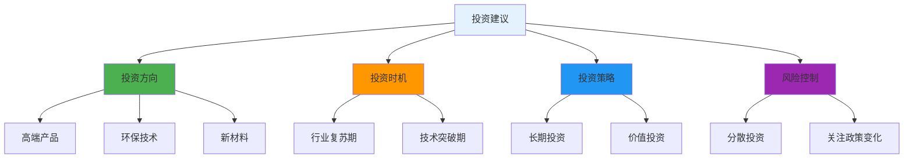

</div>

---

## 📊 11. 数据附录

### 11.1 全球市场分布

<div align="center">

| 地区 | 市场份额 | 主要特点 | 发展趋势 |
|------|----------|----------|----------|
| 🇨🇳 **中国** | 40% | 产能最大，成本优势明显 | 向高端化、绿色化发展 |
| 🇺🇸 **北美** | 25% | 技术领先，高端产品占比高 | 技术创新，环保要求 |
| 🇪🇺 **欧洲** | 20% | 环保要求高，绿色技术领先 | 绿色化、智能化发展 |
| 🌍 **其他** | 15% | 新兴市场，增长潜力大 | 产能扩张，技术引进 |

</div>

### 11.2 主要产品市场结构

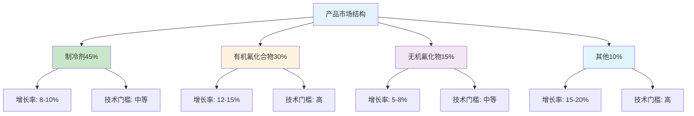

---

## 📝 12. 更新记录 (Update Log)

<div align="center">

| 更新日期 | 分析师 | 数据来源 | 重要更新 |
|----------|--------|----------|----------|
| **2025年8月** | FinSight分析团队 | 行业协会、公司公告、公开数据 | 基于2024年行业数据和2025年政策趋势更新分析 |

</div>

---

<div align="center">

**🏭 报告完成**

*本报告基于公开信息分析，数据仅供参考，投资有风险，入市需谨慎。*

**FinSight - 专业的公司分析与行业研究平台** 🚀

</div> 